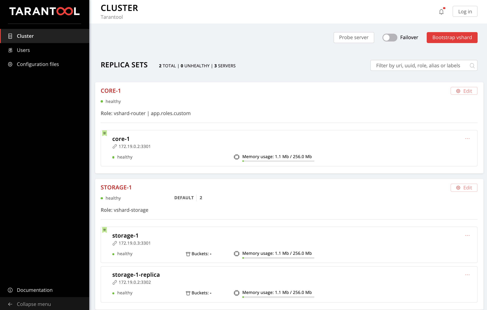

# Ansible Role: Tarantool Cartridge

An Ansible role to easily deploy
[Tarantool Cartridge](https://github.com/tarantool/cartridge) applications.

This role can deploy and configure applications packed in RPM using
[`Cartridge CLI`](https://github.com/tarantool/cartridge-cli).

See the [getting started guide](./examples/getting-started-app/README.md)
to learn how to set up topology using this role.

## Table of contents

* [Requirements](#requirements)
* [Usage example](#usage-example)
* [Getting started](#getting-started)
* [Role variables](#role-variables)
* [Role tags](#role-tags)
* [Example scenario](#example-scenario)
* [Configuration format](#configuration-format)
  * [Instances](#instances)
  * [Replica sets](#replica-sets)
  * [Instances expelling](#instances-expelling)
  * [Vshard bootstrapping](#vshard-bootstrapping)
  * [Failover](#failover)
  * [Cartridge authorization](#cartridge-authorization)
  * [Application configuration](#application-configuration)


## Requirements

* Tarantool Cartridge >=1.2.0, <2;
* Ansible 2.8.4 or higher.

Note that this role requires [root access](https://docs.ansible.com/ansible/2.4/become.html).

## Usage example

First, you need to install this role using `ansible-galaxy`:

```bash
$ ansible-galaxy install tarantool.cartridge,1.2.0
```

Example cluster topology:



To deploy an application and set up this topology:

`playbook.yml`:

```yaml
---
- name: Deploy my Tarantool Cartridge app
  hosts: all
  become: true
  become_user: root
  any_errors_fatal: true
  tasks:
  - name: Import Tarantool Cartridge role
    import_role:
      name: tarantool.cartridge
```

`hosts.yml`:

```yaml
---
all:
  vars:
    cartridge_package_path: ./myapp-1.0.0-0.rpm
    cartridge_cluster_cookie: secret-cookie
    cartridge_defaults:
      log_level: 1

  hosts:  # instances
    core-1:
      config:
        advertise_uri: '172.19.0.2:3301'
        http_port: 8081

    storage-1-replica:
      config:
        advertise_uri: '172.19.0.2:3302'
        http_port: 8082
      restarted: true  # force instance restart

    storage-1:
      config:
        advertise_uri: '172.19.0.3:3301'
        http_port: 8091

  children:
    # group instances by machines
    host1:
      vars:
        # first machine address and connection opts
        ansible_host: 172.19.0.2
        ansible_user: vagrant

      hosts:  # instances to be started on this host
        core-1:
        storage-1-replica:

    host2:
      vars:
        # second machine address and connection opts
        ansible_host: 172.19.0.3
        ansible_user: vagrant

      hosts:  # instances to be started on this host
        storage-1:

    # group instances by replicasets
    storage_1_replicaset:  # replicaset storage-1
      hosts:  # instances
        storage-1:
        storage-1-replica:
      vars:
        # replicaset configuration
        replicaset_alias: storage-1
        weight: 2
        failover_priority:
          - storage-1  # leader
          - storage-1-replica

        roles:
          - 'vshard-storage'

    core_1_replicaset:  # replicaset core-1
      hosts:  # instances
        core-1:

      vars:
        # replicaset configuration
        replicaset_alias: core-1
        roles:
          - 'app.roles.custom'
          - 'vshard-router'
```

## Getting started

See the [getting started guide](./examples/getting-started-app/README.md)
to learn how to set up topology using this role.

## Role variables

Role variables are used to configure started instances, cluster topology,
vhsard bootstrapping, and failover.

Configuration format is described in detail in the
[configuration format](#configuration-format) section.

* `cartridge_package_path` (`string`, optional): path to Cartridge RPM package
  (application name will be detected as package name);
* `cartridge_app_name` (`string`): application name, required;
* `cartridge_cluster_cookie` (`string`, required): cluster cookie for all
  cluster instances;
* `cartridge_defaults` (`dict`, optional, default: `{}`): default configuration
  parameters values for instances;
* `cartridge_bootstrap_vshard` (`boolean`, optional, default: `false`): boolean
  flag that indicates if vshard should be bootstrapped;
* `cartridge_failover` (`boolean`, optional): boolean flag that indicates if
  failover should be enabled or disabled;
* `cartridge_app_config` (`dict`, optional): application config sections to patch;
* `cartridge_auth`: (`dict`, optional): [authorization configuration](#cartridge-authorization);
* `cartridge_enable_tarantool_repo` (`boolean`, optional, default: `true`):
  indicates if the Tarantool repository should be enabled (for packages with
  open-source Tarantool dependency);
* `config` (`dict`, required): [instance configuration](#instances);
* `restarted` (`boolean`, optional, default: `false`): indicates that instance must be forcedly restarted;
* `expelled` (`boolean`, optional, default: `false`): boolean flag that indicates if instance must be expelled from topology;
* `instance_start_timeout` (`number`, optional, default: 60): time in seconds to wait for instance to be started;
* `replicaset_alias` (`string`, optional): replicaset alias, will be displayed in Web UI;
* `failover_priority` (`list-of-string`): failover priority;
* `roles` (`list-of-strings`, required if `replicaset_alias` specified): roles to be enabled on the replicaset;
* `all_rw` (`boolean`, optional): indicates that that all servers in the replicaset should be read-write;
* `weight` (`number`, optional): vshard replicaset weight (matters only if `vshard-storage` role is enabled.

### Role tags

This role tasks have special tags that allows to perform only secified actions.
Tasks are running in this order:

* `cartridge-instances` - install package, update instances config and restart instances;
* `cartridge-replicasets` - configure replicasets, expel instances;
* `cartridge-config` - configure cluster, contains this tasks:
  * configure authorization (if `cartridge_auth` is defined);
  * patch application clusterwide config (if `cartridge_app_config` is defined);
  * bootstrap Vshard (if `cartridge_bootstrap_vshard` is defined);
  * manage cartridge failover (if `cartridge_failover` is defined).

**Note**, that `cartridge-config` tasks would be skipped if no one of `cartridge_auth`, `cartridge_app_config`, `cartridge_bootstrap_vshard` and `cartridge_failover` variables is specified.

### Example scenario

Using `--limits` and `--tags` options you can manage cluster different ways:

#### Run all tasks for all hosts

All instances will be started (if not started yet) or updated (restarted) if instance configuration or package was updated.
Then, instances would be joined to replicasets.
If cluster configuration was specified, it would be updated.

```bash
ansible-playbook -i hosts.yml playbook.yml
```

#### Start one instance

**Note**, that this instance will be joined to the replicaset if replicaset options are specified for it.
To prevent it you need to specify `--tags cartridge-instances`.

```bash
ansible-playbook -i hosts.yml playbook.yml --limit core-1
```

#### Start and join one replicaset

```bash
ansible-playbook -i hosts.yml playbook.yml --limit core_1_replicaset
```

#### Update instances in one replicaset

Instances from `storage_1_replicaset` group will be started (if not started yet) or updated (restarted) if instance configuration or package was updated.

```bash
ansible-playbook -i hosts.yml playbook.yml --limit storage_1_replicaset \
                                          --tags cartridge-instances
```

#### Update instances on one machine

Instances from `host1` machine will be started (if not started yet) or updated (restarted) if instance configuration or package was updated.

```bash
ansible-playbook -i hosts.yml playbook.yml --limit host1 \
                                          --tags cartridge-instances
```

#### Join instances to replicaset

Instances from `storage_1_replicaset` group will be joined to replicaset.

```bash
ansible-playbook -i hosts.yml playbook.yml --limit storage_1_replicaset \
                                           --tags cartridge-replicasets
```

#### Start and join other replicaset instances

```bash
ansible-playbook -i hosts.yml playbook.yml --limit core_1_replicaset \
                        --tags cartridge-instances,cartridge-replicasets
```

#### Patch cluster configuration

Manage cartridge configuration parameters.

```bash
ansible-playbook -i hosts.yml playbook.yml --tags cartridge-config
```

## Configuration format

Instances and replica sets are identified by names, so you must use unique names
to avoid collisions.

### Application

You can specify path to the rpm package to be installed using
`cartridge_package_path`.
Note, that `cartridge_package_path` must be the same for instances on one machine.

This role does not allow package downgrades because this may drive the cluster
inoperative.
If you are sure that you need to downgrade package and you are aware of the risks,
you can perform this action manually (for example, using Ansible
[yum](https://docs.ansible.com/ansible/latest/modules/yum_module.html) module).

You should specify `cartridge_app_name` to allow Ansible to manage application correctly.

### Instances

Each instance of application is started as `<app_name>@<instance_name>` systemd service.
`instance_name` is `inventory_hostname` from Ansible inventory.

Instance can be configured using the `config` variable.
This variable describes instance parameters that would be passed to cartridge configuration.
It can contain [cluster-specific](https://www.tarantool.io/en/rocks/cartridge/1.0/modules/cartridge.argparse/#cluster-opts) parameters or some application-specific parameters (can be parsed in application using the [`cartridge.argparse`](https://www.tarantool.io/en/rocks/cartridge/1.0/modules/cartridge.argparse) module).

#### Required parameters

`advertise_uri` is required parameter for instance configuraion.
It must be specified in `<host>:<port>` format.

#### Forbidden parameters

`alias`, `console_sock`, `pid_file`, and `workdir` parameters are forbidden
for an instance.

Instance alias will be set equal to instance name.

**Note:** in the default systemd unit file for Tarantool Cartridge applications,
some instance parameters are set:

```
Environment=TARANTOOL_WORKDIR=/var/lib/tarantool/{app_name}.{instance_name}
Environment=TARANTOOL_CFG=/etc/tarantool/conf.d/
Environment=TARANTOOL_PID_FILE=/var/run/tarantool/${app_name}.{instance_name}.pid
Environment=TARANTOOL_CONSOLE_SOCK=/var/run/tarantool/${app_name}.{instance_name}.control
```

#### Increasing memtx_memory in runtime

If you specified in `config.memtx_memory` value that increases current `memtx_memory`, this role will try to increase this value in runtime.
In case of success instance wouldn't be restarted (if other parameters haven't been changed).

**Note**, that if `restarted` flag is set, instance will be restarted anyway without changing `memtx_memory` in runtime.
You can use this flag to force instance restarting.

### Replica sets

You can find more details about replicasets and automatic failover in [Tarantool Cartridge administrator’s guide](https://www.tarantool.io/en/doc/2.2/book/cartridge/cartridge_admin/#enabling-automatic-failover).

To configure replicasets you need to specify replicaset parameters for each instance in replicaset:

* `replicaset_alias` (`string`, optional) - replicaset alias, will be displayed in Web UI;
* `failover_priority` (`list-of-strings`, optional) - failover prioriry order.
  First instance will be replicaset leader.
  It isn't required to specify all instances here, you can specify only one or more.
  Other instances will have lower priority;
* `roles` (`list-of-strings`, required if `replicaset_alias` specified) - roles to be enabled on the replicaset.
* `all_rw` (`boolean`, optional): indicates that that all servers in the replicaset should be read-write;
* `weight` (`number`, optional): vshard replicaset weight (matters only if `vshard-storage` role is enabled;
* `vshard_group` (`string`, optional): vshard group (plase, read [this](#specifying-vshard-group) section before using this parameter);

The easiest way to configure replicaset is to [group instances](https://docs.ansible.com/ansible/latest/user_guide/intro_inventory.html) and set replicaset parameters for all instances in a group.

#### Specifying vshard group

If your application is designed to use multiple independent vshard groups (see cartridge
[documentation](https://www.tarantool.io/en/doc/2.2/book/cartridge/cartridge_dev/#using-multiple-vshard-storage-groups)), you can specify vshard group for `vshard-storage` repicaset `vshard_group`
parameter.
This parameter will be ignored for replicaset with other roles.
By default, all `vshard-storage` replicasets belong to group `default`

Be very careful using this parameter.
Once you specified `vshard_group`, it can't be changed.
Moreover, **your application should support specified group**.
It means that your  application should pass vshard groups configuration in
`cartridge.cfg()` call.

For example, if your application configures `hot` and `cold` vshard groups ...

```lua
-- init.lua

...
cartridge.cfg({
  ...
  vshard_groups = {
    hot = { bucket_count = 20000 },
    cold = { bucket_count = 30000 },
  }
})
```

... you can specify them to be used by `vshard-storage` replicaset:

```yaml
    hot_storage_replicaset:
      hosts:
        hot-storage:
      vars:
        replicaset_alias: hot-storage
        roles: [vshard-storage]
        vshard_group: hot
```

### Instances expelling

To expel instance set `expelled` flag to true.
For example:

```yaml
  core-1:
    config:
      advertise_uri: '172.19.0.2:3301'
      http_port: 8081
    expelled: true  # mark instance to be expelled
```

Instances expelling is performed after apllying replicasets configuration.
In is tagged as a `cartridge-replicasets` tasks.

After instance is expelled from the topology, it's systemd service would be stopped and disabled.
Then, all instance files (configuration file, socket and working directory) would be deleted.

### Vshard bootstrapping

The flag `cartridge_bootstrap_vshard` indicates if vshard must be bootstrapped
on the cluster.

First, it will be checked if it is reasonable to bootstrap vshard (the cluster
must have at least one `vshard-storage` replica set and at least one
`vshard-router`). If it is, vshard will be bootstrapped.

### Failover

If `cartridge_failover` is `true`, then failover will be enabled.
If it is `false` - failover will be disabled.

### Cartridge authorization

`cartridge_auth` parameter is used to specify authorization settings:

- `enabled`(`boolean`, optional) - indicates if authorization is enabled;
- `cookie_max_age`(`int`, optional) - number of seconds until the authorization
  cookie expires;
- `cookie_renew_age`(`int`, optional) - update the provided cookie if it's older
  than this age.
- `users`(`list-of-dicts`, optional) - list of users to be configured on the
  cluster (described below).

**Users configuration:**

- `username`(`string`, required);
- `password`(`string`, optional) - is required for new users;
- `fullname`(`string`, optional);
- `email`(`string`, optional);
- `deleted`(`boolean`, optional) - indicates if the user must be removed.

**Note:** The default user `admin` can't be managed here.

*Example:*

```yaml
cartridge_auth:
  enabled: true   # enable authorization

  cookie_max_age: 1000
  cookie_renew_age: 100

  users:  # cartridge users to set up
    - username: tarantool
      password: tarantool-the-best
      fullname: Tarantool The Best
      email: tarantool@tarantool.org

    - username: bad-guy
      deleted: true  # marked to be deleted
```

### Application configuration

`cartridge_app_config` variable is used to edit cluster configuration.
It allows to define configuration sections in a special format:

```yaml
cartridge_app_config:
  <section_name>:
    body: <section body>
    deleted: <boolean>
```
**Note:**
* sections with the `deleted` flag set up will be deleted;
* sections not mentioned here won't be changed;
* other sections values will be replaced with the section `body` value.

*Example*

If your cluster configuration looks like:

```yaml
section-1: value-1  # section body is a string

section-2:  # section body is a table
  key-21: value-21
  key-22: value-22

section-3:
  key-31: value-31
```

... after running a role with this `cartridge_app_config`:

```yaml
cartridge_app_config:
  section-2:
    body:
      key-21: value-21-new

  section-3:
    deleted: true
```

... it will be:

```yaml
section-1: value-1  # hasn't been changed

section-2:
  key-21: value-21-new  # body was replaced
```
