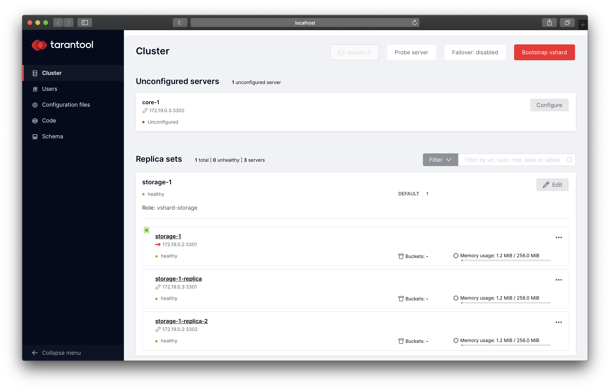
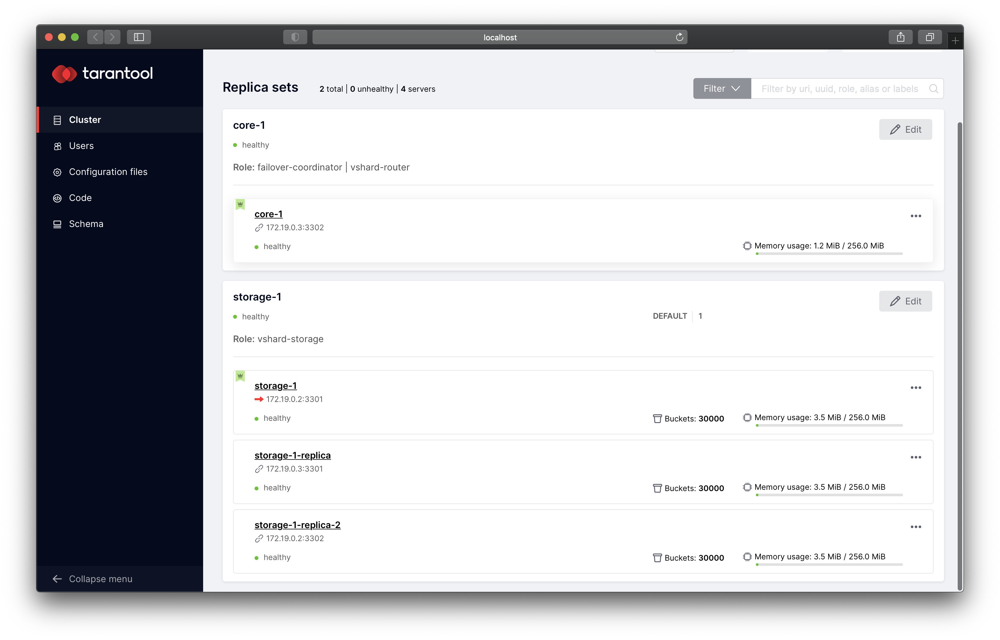

# Getting Started

This simple guide shows how to deploy Tarantool Cartridge application
and set up topology.

First, we will deploy application package to virtual machines, start
two instances and join them to replicaset.
Then, we will start one more instance and create replicaset
step-by-step.

## Requirements

* [Vagrant](https://www.vagrantup.com/) with [VirtualBox provider](https://www.vagrantup.com/docs/providers/virtualbox)
  (generally, you can use other Vagrant provider)

* [Ansible](https://docs.ansible.com/ansible/latest/installation_guide/intro_installation.html) >= 2.8.0
* [`Cartridge CLI`](https://github.com/tarantool/cartridge-cli#installation) >= 2.0.0

## Prepare

To go through this tutorial you should be in this directory:

```bash
cd cook-book/getting-started
```

**Check out the [configuration basics guide](/doc/configuration-basics.md)
to be sure that you understand the way to write cluster configuration.**

Install role from Ansible Galaxy (use newer version if it's available):

```bash
$ ansible-galaxy install tarantool.cartridge
```

Start two virtual machines described in [Vagrantfile](./Vagrantfile):

```bash
vagrant up
```

Place [application package](/cook-book/create-packages.md) into current directory or specify right path in `hosts.yml`.

## Deploy application and set up topology

First, deploy first version of application on virtual machines,
start two instances and join them to replicaset.

Run playbook:

```bash
ansible-playbook -i hosts.yml playbook.prepare.yml
```

Now go to http://localhost:8181/admin/cluster/dashboard:


### Using scenario

We've just start two instances and join them to replicaset via running one playbook.
But this is bad approach to start instances, edit topology and configure cluster
at once.
We will start more instances, add them to topology and edit cluster
configuration step by step.

Since version [1.8.0](https://github.com/tarantool/ansible-cartridge/releases/tag/1.8.0)
`tarantool.cartridge` role allows to specify [scenario](/doc/scenario.md)
that consists of steps.
The role has pre-defined [steps](/doc/scenario.md#steps), but you can also
[write your own step](/doc/scenario.md#adding-custom-step-to-scenario) and
use it in scenario.

Using scenarios allows to perform different actions with cluster separately.

The role has several common [scenarios](/doc/scenario.md#scenarios) that
can be re-used.
It's also possible to write custom scenario and then use it in different plays.

### Change configuration

Now we have such topology:

* `storage-1` replicaset (`vshard-storage`):
  * `storage-1-leader`
  * `storage-1-replica`

Let's add `core-1` replicaset and add one more replica to `storage-1` replicaset.
We should get the following topology:

* `core-1` replicaset (`vshard-router`, `failover-coordinator`):
  * `core-1`

* `storage-1` replicaset (`vshard-storage`):
  * `storage-1-leader`
  * `storage-1-replica`
  * `storage-1-replica-2`

**Now stop reading.
Be sure that you've read
[configuration basics guide](/doc/configuration-basics.md)
to understand what is inventory and how do we change it.**

Change [inventory](./hosts.yml).
You can save this diff to file and apply it using `git apply`.

```diff
diff --git a/cook-book/getting-started/hosts.yml b/cook-book/getting-started/hosts.yml
--- a/cook-book/getting-started/hosts.yml
+++ b/cook-book/getting-started/hosts.yml
@@ -23,6 +23,16 @@ all:
         advertise_uri: '172.19.0.3:3301'
         http_port: 8191

+    storage-1-replica-2:
+      config:
+        advertise_uri: '172.19.0.2:3302'
+        http_port: 8182
+
+    core-1:
+      config:
+        advertise_uri: '172.19.0.3:3302'
+        http_port: 8192
+
   children:
     # group instances by machines
     machine_1:
@@ -32,6 +42,7 @@ all:

       hosts:
         storage-1:
+        storage-1-replica-2:

     machine_2:
       vars:
@@ -40,12 +51,14 @@ all:

       hosts:
         storage-1-replica:
+        core-1:

     # group instances by replicasets
     replicaset_storage_1:
       hosts:
         storage-1:
         storage-1-replica:
+        storage-1-replica-2:
       vars:
         replicaset_alias: storage-1
         failover_priority:
@@ -53,3 +66,12 @@ all:
           - storage-1-replica
         roles:
           - vshard-storage
+
+    replicaset_core_1:
+      hosts:
+        core-1:
+      vars:
+        replicaset_alias: core-1
+        roles:
+          - vshard-router
+          - failover-coordinator
```

### Configure instances

To start and configure instance we can use
[`configure_instances`](/doc/scenario.md#scenarios) pre-defined scenario.
But it also contain steps we don't need (like `deliver_package` and `update_package`).
`update_instance` step is used only with [multiversion approach](/doc/multiversion.md),
so it can be removed too.

This `cartridge_scenario` is used in [playbook.configure-instances.yml](./playbook.configure-instances.yml):

```yaml
cartridge_scenario:
  - configure_instance
  - restart_instance
  - wait_instance_started
```

Run new playbook and specify limit (instances that should be cofigured):

```bash
ansible-playbook -i hosts.yml playbook.configure-instances.yml \
    --limit storage-1-replica-2,core-1
```

Go to http://localhost:8182/admin/cluster/dashboard:


Now we have two new unconfigured instances.

### Accessing instances status and logs

To check instance systemd service just connect to virtual machine and call
`systemctl status`:

```bash
vagrant ssh vm1
[vagrant@localhost ~]$ sudo systemctl status myapp@core-1
● myapp@core-1.service - Tarantool Cartridge app myapp@core-1
   Loaded: loaded (/etc/systemd/system/myapp@.service; enabled; vendor preset: disabled)
   Active: active (running) since Fri 2021-04-02 17:33:14 UTC; 4min 33s ago
  Process: 6413 ExecStartPre=/bin/sh -c mkdir -p /var/lib/tarantool/myapp.%i (code=exited, status=0/SUCCESS)
 Main PID: 6414 (tarantool)
   CGroup: /system.slice/system-myapp.slice/myapp@core-1.service
           └─6414 tarantool init.lua: myapp@core-1
```

You can also use wildcard to get all `myapp` instance status:

```bash
sudo systemctl status myapp@*
```

Instances logs are available with `journalctl`.
It can be helpful to pipe them to `less`:

```bash
sudo journalctl -u myapp@core-1 | less
```

### Configure topology

When we sure that instances have started successfully it's time to join them
to replicasets.

We will use [`configure_topology`](/doc/scenario.md#scenarios) pre-defined scenario
to manage replicasets.

Specify `cartridge_scenario_name` in [playbook.configure-topology.yml](./playbook.configure-topology.yml):

```yaml
cartridge_scenario_name: configure_topology
```

Ansible allows to [limit](https://docs.ansible.com/ansible/latest/user_guide/intro_patterns.html)
hosts configured by one playbook.
It's convenient to manage one replicaset by specifying replicaset group.

First, join new instance to `storage-1` replicaset:

```bash
ansible-playbook -i hosts.yml playbook.configure-topology.yml \
    --limit replicaset_storage_1
```

You can check new topology on http://localhost:8182/admin/cluster/dashboard:



Create `core-1` replicaset:

```bash
ansible-playbook -i hosts.yml playbook.configure-topology.yml \
    --limit replicaset_core_1
```

New topology on http://localhost:8182/admin/cluster/dashboard:


### Bootstrap vshard

Now we have both `vshard-storage` and `vshard-router` replicasets.
It's time to bootstrap vshard.

We need the only one [`bootstrap_vshard` step](/doc/scenario.md#bootstrap_vshard).
It requires `cartridge_bootstrap_vshard` variable set to `true` to run
vshard bootstrapping.

Specify it in [playbook.bootstrap-vshard.yml](./playbook.bootstrap-vshard.yml):

```yaml
cartridge_bootstrap_vshard: true
cartridge_scenario:
  - bootstrap_vshard
```

Run:

```bash
ansible-playbook -i hosts.yml playbook.bootstrap-vshard.yml
```

You can go to http://localhost:8182/admin/cluster/dashboard,
reload the page and check that `Bootstrap vshard` button was disappeared and instances have discovered buckets:



## What's next?

* start [stateboard instance](/doc/stateboard.md);
* check out list of [available steps](/doc/scenario.md#steps);
* set up [cluster configuration](/doc/variables.md#cluster-configuration)
  parameters, such as authorization, failover and application configuration.

Don't forget to stop virtual machines after all:

```bash
vagrant halt
```
