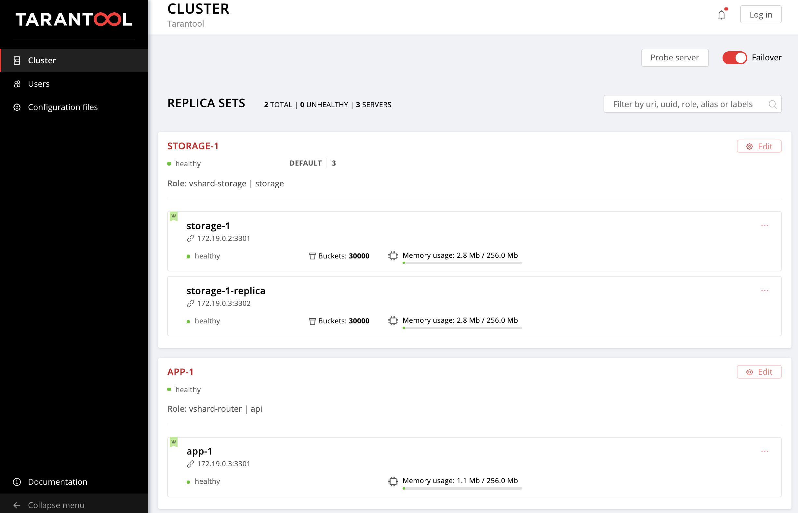
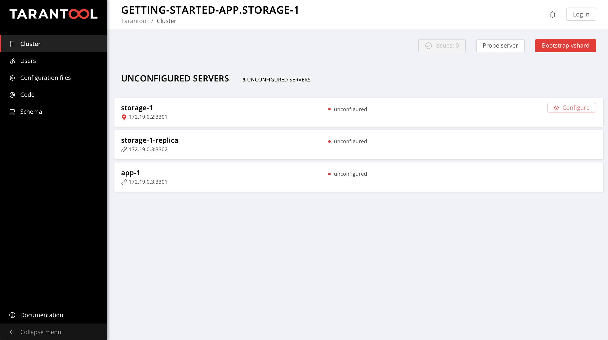
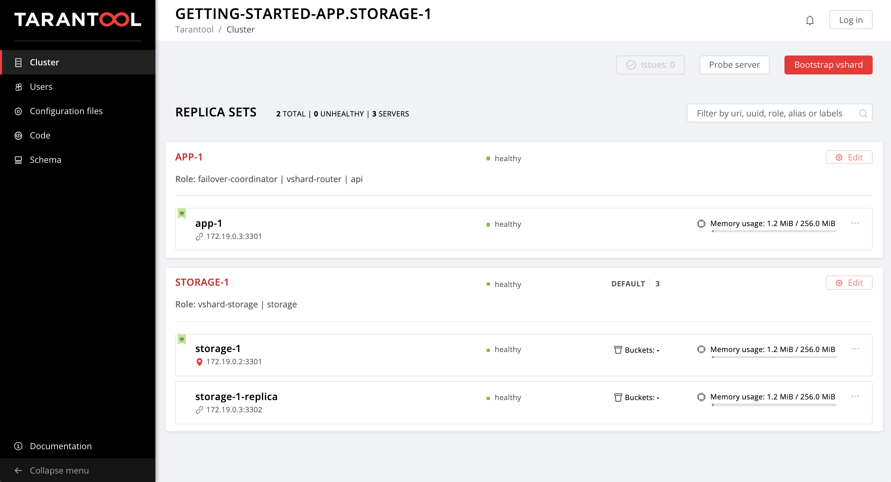

# Tarantool Cartridge application deploy example

Here we will show you how to easily deploy your Tarantool Cartridge application,
set up the topology, and configure a cluster.

## Table of contents

* [What shall we do?](#what-shall-we-do)
* [Setting up the environment](#setting-up-the-environment)
* [Packing a test application](#packing-a-test-application)
  * [Packing on Linux](#packing-on-linux)
  * [Packing on OS X](#packing-on-os-x)
* [What does Tarantool Cartridge role do?](#what-does-tarantool-cartridge-role-do)
  * [Deploying the package](#deploying-the-package)
  * [Starting instances](#starting-instances)
  * [Setting up the topology](#setting-up-the-topology)
* [Deploying with Ansible](#deploying-with-ansible)
  * [About Ansible](#about-ansible)
  * [Prepare to deploy](#prepare-to-deploy)
  * [Start virtual machines](#start-virtual-machines)
  * [Start instances](#start-instances)
  * [Set up replica sets](#set-up-replica-sets)
  * [Bootstrap vshard](#bootstrap-vshard)
  * [Manage failover](#manage-failover)
  * [Manage authorization](#manage-authorization)
  * [Application configuration](#application-configuration)
* [Final checks](#final-checks)
* [Afterword](#afterword)
* [Full inventory](#full-inventory)

## What shall we do?

We have a [getting started guide](https://github.com/tarantool/cartridge-cli/tree/master/examples/getting-started-app)
for *developing* a Tarantool Cartridge application.
Now you will learn how to *deploy* this application on servers and
*set up the topology* using Ansible.

Our example application implements two roles:

* `api` (with `vshard-router` dependency),
* `storage` (with `vshard-router` dependency).

We will set up a simple topology on 2 virtual machines, `vm1` and `vm2`:

* replicaset `app-1`:
  * roles: `api` (+ `vshard-router`)
  * instances:
    * `app-1` (`vm2`)

* replicaset `storage-1`
  * roles: `storage` (+ `vshard-storage`)
  * instances:
    * `storage-1` (`vm1`)
    * `storage-1-replica` (`vm2`)

In the cluster Web UI, it will look like this:



## Setting up the environment

To work with Tarantool Cartridge you need to install these tools:

* `git` - a version control system (see details [here](https://git-scm.com/));
* `npm`- a package manager for `node.js` (see details [here](https://www.npmjs.com/));
* `cmake` version 2.8 or higher;
* `tarantool` version 10.3 or higher;
* `tarantool-devel` - developer package for `tarantool`;
* `gcc` - a `C` compiler (see details [here](https://gcc.gnu.org/));
* `unzip`- an archiving utility.

Note that the minimal Tarantool Cartridge version for using the Ansible role is
`1.2.0`.

To run this guide example, you need:

* `ansible` version 2.8 or higher - a deploy automation tool
  (see details [here](https://docs.ansible.com/ansible/latest/installation_guide/intro_installation.html))
* `vagrant` - a virtual machines management tool (see details [here](https://www.vagrantup.com/))

You also need to install `vagrant-hosts`, `vagrant-vbguest` and `vagrant-scp` plugins:

```bash
$ vagrant plugin install vagrant-hosts vagrant-vbguest vagrant-scp
```

## Packing a test application

We will use [`getting-started-app`](https://github.com/tarantool/cartridge-cli/tree/master/examples/getting-started-app)
to show how to properly deploy a Tarantool Cartridge application.

### Packing on Linux

The easiest way to get the final version of `getting-started-app` is to clone it:

```bash
$ git clone https://github.com/tarantool/cartridge-cli
$ cp -R cartridge-cli/examples/getting-started-app .
$ rm -rf cartridge-cli
```

Now we have the `getting-started-app` directory containing our test application.

Let's pack this application.
First, install [Tarantool Cartridge CLI](https://github.com/tarantool/cartridge-cli):

```bash
$ tarantoolctl rocks install cartridge-cli
```

Then, just call:

```bash
.rocks/bin/cartridge pack rpm --version 1.0.0 ./getting-started-app
```

Now, we have the `getting-started-app-1.0.0-0.rpm` file in the current directory.
The next step is to deploy this package on a server and set up a cluster.

### Packing on OS X

Unfortunately, if you use OS X to develop the application, you can't pack the
application on your local machine and then deploy it on RHEL or Debian.
The problem is that the package will contain rocks (and `tarantool` binaries
in case of Tarantool Enterprise) specific for OS X.

The workaround is to pack the application in a Vagrant VM:

Create `Vagrantfile` from [this](#prepare-to-deploy) section and run:

```bash
$ vagrant up vm1
$ vagrant ssh vm1
[vagrant@vm1 ~]$ curl -s https://packagecloud.io/install/repositories/tarantool/1_10/script.rpm.sh | sudo bash
[vagrant@vm1 ~]$ curl -sL https://rpm.nodesource.com/setup_8.x | sudo bash -
[vagrant@vm1 ~]$ sudo yum -y install unzip git gcc cmake nodejs tarantool tarantool-devel
```

This will install Tarantool 1.10 and all the tools required for Tarantool Cartridge.

Next:

```bash
[vagrant@vm1 ~]$ git clone https://github.com/tarantool/cartridge-cli
[vagrant@vm1 ~]$ cp -R cartridge-cli/examples/getting-started-app .
[vagrant@vm1 ~]$ rm -rf cartridge-cli
[vagrant@vm1 ~]$ tarantoolctl rocks install cartridge-cli
[vagrant@vm1 ~]$ .rocks/bin/cartridge pack rpm --version 1.0.0 ./getting-started-app
[vagrant@vm1 ~]$ sudo yum -y remove tarantool
[vagrant@vm1 ~]$ exit
$ vagrant scp vm1:~/getting-started-app-1.0.0-0.rpm .
```

The last command copies RPM from VM on your local machine.

Now, you can stop the VM:

```bash
$ vagrant halt vm1
```

Now, we have the `getting-started-app-1.0.0-0.rpm` file in the current directory.
The next step is to deploy this package on servers and set up a cluster.

## What does Tarantool Cartridge role do?

Here follows a description of deploy steps, just to understand the way
Tarantool Cartridge applications should be deployed.
You can skip this section if you are not interested in understanding how it works
under the hood, and proceed directly to [deployment steps](#deploying-with-ansible).

### Deploying the package

The first step is to install the application package on a deployment server.
Here we will create a user `tarantool` with a group `tarantool` and some directories
for our app:

* `/etc/tarantool/conf.d/` - directory for instances configuration;
* `/var/lib/tarantool/` - directory to store instances snapshots;
* `/var/run/tarantool/` - directory to store PID-files and console sockets.

Application code will be placed in the `/usr/share/tarantool/${app-name}` directory.
If you use Tarantool Enterprise, `tarantool` and `tarantoolctl` binaries will be
delivered with the package and placed there too.
Otherwise, your RPM package has a Tarantool dependency and `yum` (RPM packages
manager) will install open-source Tarantool.

The package also contains `/etc/systemd/system/${app-name}.service` and
`/etc/systemd/system/{app-name}@.service`
[systemd unit files](https://www.digitalocean.com/community/tutorials/understanding-systemd-units-and-unit-files).

### Starting instances

When you call `systemctl start getting-started-app@storage-1`, systemd starts
the `storage-1` instance of the `getting-started-app` service
(see [systemd template units](https://fedoramagazine.org/systemd-template-unit-files/)).
This instance will look up its configuration across all
sections of the YAML file(s) stored in `/etc/tarantool/conf.d/*`.

See [documentation](https://www.tarantool.io/en/doc/2.2/book/cartridge/cartridge_dev/#configuring-instances)
for details on instance configuration.

### Setting up the topology

After the instances are started, you need to set up the cluster topology,
manage authorization parameters, browse application configuration,
enable automatic failover, and bootstrap vshard.

All these actions can be performed using the cluster WebUI or the `cartridge`
module API.

To use the API, you can connect to the instance console using a socket:

```bash
$ tarantoolctl connect /var/run/tarantool/getting-started-app.storage-1.control
tarantool> require('cartridge').is_healthy()
```

## Deploying with Ansible

### About Ansible

We will be using [Ansible](https://www.ansible.com/use-cases/application-deployment)
to deploy and configure our application.
to figure out how to work with this framework, you can read the
[docs](https://docs.ansible.com/ansible/latest/index.html) and
check out some [Russian](https://habr.com/ru/post/305400/)
/
[English](https://scotch.io/tutorials/getting-started-with-ansible))
getting-started guides.

### Prepare to deploy

We packed our application in `getting-started-app-1.0.0-0.rpm`.

Now, we will start 3 instances on 2 different servers, join them in 2 replica
sets, bootstrap vshard, enable automatic failover, set up authorization and
application configuration.

First, use [vagrant](https://www.vagrantup.com/intro/index.html) to start two
virtual machines on `172.19.0.2` and `172.19.0.3`.

`Vagrantfile`:

```
boxes = [
    {
        :name     => "vm1",
        :ip => "172.19.0.2",
        :ports    => [8181],
    },
    {
        :name     => "vm2",
        :ip => "172.19.0.3",
        :ports    => [8182, 8183],
    },
]

Vagrant.configure("2") do |config|
  config.vm.provider "virtualbox" do |v|
    v.memory = 2048
  end

  # Base Vagrant VM configuration
  config.vm.box = "centos/7"
  config.ssh.insert_key = false
  config.vm.synced_folder ".", "/vagrant", disabled: true

  # Configure all VMs
  boxes.each_with_index do |box, index|
    config.vm.define box[:name] do |box_config|
      box_config.vm.hostname = box[:hostname]
      box_config.vm.network "private_network", ip: box[:ip]
      box[:ports].each do |port|
        box_config.vm.network "forwarded_port",
                              guest: port,
                              host: port,
                              autocorrect: true
      end
    end
  end
end
```

Next, install the Tarantool Cartridge role using `ansible-galaxy` CLI:

```bash
$ ansible-galaxy install tarantool.cartridge,1.2.0
```


Then, create an
[Ansible playbook](https://docs.ansible.com/ansible/latest/user_guide/playbooks_intro.html)
and import the Tarantool Cartridge role.

`playbook.yml`:

```yaml
---
- name: Deploy my Tarantool Cartridge app
  hosts: all
  become: true
  become_user: root
  any_errors_fatal: true
  tasks:
  - name: Import Tarantool Cartridge role
    import_role:
      name: tarantool.cartridge
```

Finally, create empty [inventory](https://docs.ansible.com/ansible/latest/user_guide/intro_inventory.html) file `hosts.yml`:

The resulting directory structure:

```
.
├── Vagrantfile
├── getting-started-app  # this dir is not required
├── getting-started-app-1.0.0-0.rpm
├── hosts.yml
├── playbook.yml
```

### Start virtual machines

First, start the virtual machines:

```bash
$ vagrant up
```

Further we'll be gradually upgrading the `hosts.yml` inventory file to deploy and
configure our application step by step.
We'll be showing only new sections of the inventory, but you can see the
[full version](#full-inventory) anytime.

### Start instances

Specify this in your `hosts.yml`:

```yaml
---
all:
  vars:
    cartridge_app_name: getting-started-app  # application name
    cartridge_package_path: ./getting-started-app-1.0.0-0.rpm  # path to package to deploy

    cartridge_cluster_cookie: app-default-cookie  # cluster cookie
    cartridge_defaults:  # default instance parameters
      log_level: 5

    # common ssh options
    ansible_ssh_private_key_file: ~/.vagrant.d/insecure_private_key
    ansible_ssh_common_args: '-o IdentitiesOnly=yes -o UserKnownHostsFile=/dev/null -o StrictHostKeyChecking=no'

  hosts:  # instances configuration
    storage-1:
      config:
        advertise_uri: '172.19.0.2:3301'
        http_port: 8181

    app-1:
      config:
        advertise_uri: '172.19.0.3:3301'
        http_port: 8182

    storage-1-replica:
      config:
        advertise_uri: '172.19.0.3:3302'
        http_port: 8183

  children:
    # group instances by machines
    host1:  # first machine address and connection opts
      vars:
        ansible_host: 172.19.0.2
        ansible_user: vagrant

      hosts:  # instances to be started on this machine
        storage-1:

    host2:  # second machine address and connection opts
      vars:
        ansible_host: 172.19.0.3
        ansible_user: vagrant

      hosts:  # instances to be started on this machine
        app-1:
        storage-1-replica:
```

Now, run the playbook:

```bash
$ ansible-playbook -i hosts.yml playbook.yml
```

#### Check if package was installed

Connect to the `vm1` and check if package was installed:

```bash
$ vagrant ssh vm1
[vagrant@vm1 ~]$ yum list installed | grep getting-started-app
getting-started-app.x86_64          1.0.0-0                     installed
[vagrant@vm1 ~]$ exit
```

You can check that application files were placed in the
`/usr/share/tarantool/getting-started-app/` directory on the virtual machines.

Do the same for `vm2`.

Note that if your application uses an open-source Tarantool version, your package
has a Tarantool dependency.
The Tarantool Cartridge role will enable a Tarantool package repository to let
Tarantool be automatically installed with your application.
If you want to install Tarantool yourself (e.g. from a package), you can set
the `cartridge_enable_tarantool_repo` variable to `false`.

#### Check if instances was started

Connect to the machines and check that all the instances were started:

```bash
$ vagrant ssh vm1
[vagrant@vm1 ~]$ sudo systemctl status getting-started-app@storage-1
[vagrant@vm1 ~]$ exit
$ vagrant ssh vm2
[vagrant@vm2 ~]$ sudo systemctl status getting-started-app@app-1
[vagrant@vm2 ~]$ sudo systemctl status getting-started-app@storage-1-replica
[vagrant@vm2 ~]$ exit
```

All instances must be `active (running)`.

Instance log:

```bash
$ vagrant ssh vm1
[vagrant@vm1 ~]$ sudo journalctl -u getting-started-app@storage-1
```

You can check the instances configuration files in `/etc/tarantool/conf.d/`:

```bash
$ vagrant ssh vm1
[vagrant@vm1 ~]$ ls /etc/tarantool/conf.d/
getting-started-app.storage-1.yml  getting-started-app.yml
[vagrant@vm1 ~]$ cat /etc/tarantool/conf.d/*
getting-started-app.storage-1:
    advertise_uri: 172.19.0.2:3301
    http_port: '8181'
getting-started-app:
    cluster_cookie: app-default-cookie
    log_level: 5
```

You can also check `/var/run/tarantool/` and `/var/lib/tarantool/` content.

Go to http://localhost:8181/admin/cluster/dashboard to see our instances in the
Web UI:



If you change instance configuration in `cartridge_instances` and run the
playbook, this instance configuration file in `/etc/tarantool/conf.d/` will be
changed and the `systemd` service will be restarted.
You can experiment with adding new instances and changing `cartridge_instances`,
`cartridge_cluster_cookie`, and `cartridge_defaults` sections.
Note that the playbook will affect only the instances mentioned in the
configuration.

The instances *expelling* feature is not supported in the current version of the
Tarantool Ansible role, but it's coming soon. For now, you can use the Web UI
to expel instances.

#### Ansible groups

We grouped our hosts(instances) in two groups: `host1` and `host2`.
For each group we specified connection options (`ansible_host` and `ansible_user`).
Read the [doc](https://docs.ansible.com/ansible/latest/user_guide/intro_inventory.html) for details.

You can run playbook on one machine using `--limit` option:

```bash
$ ansible-playbook -i hosts.yml playbook.yml --limit host1
```

Or you can update only one instance:

```bash
$ ansible-playbook -i hosts.yml playbook.yml --limit storage-1
```

### Set up replicasets

Now we have instances running on two hosts.
It's time to join them to a replica set.

Now we will group our hosts by replicasets.
Don't delete anything from `hosts.yml`, just add `storage_1_replicaset` and `app_1_replicaset` groups.
`...` means that section remains unchanged.
You can look at [full inventory](#full-inventory) to understand where to add new sections.

```yaml
---
all:
  vars:
    ...
  hosts:
    ...
  children:
    # group instances by machines
    host1:  # first machine address and connection opts
      ...

    host2:  # second machine address and connection opts
      ...

    # group instances by replicasets
    storage_1_replicaset:  # replicaset storage-1
      vars:  # replicaset configuration
        replicaset_alias: storage-1
        weight: 3
        failover_priority:
          - storage-1  # leader
          - storage-1-replica
        roles: ['storage']

      hosts:  # instances
        storage-1:
        storage-1-replica:

    app_1_replicaset:  # replicaset app-1
      vars:  # replicaset configuration
        replicaset_alias: app-1
        failover_priority:
          - app-1  # leader
        roles: ['api']

      hosts:  # instances
        app-1:
```

Run the playbook:

```bash
$ ansible-playbook -i hosts.yml playbook.yml
```

Then, go to http://localhost:8181/admin/cluster/dashboard.



Note that the `storage-1` replica set has two roles, `storage` and its dependency
`vshard-storage`, and the `app-1` replica set has roles, `api` and `vshard-router`.

If you change replica set configuration and run playbook again, replica set will be updated according to the new configuration.

### Bootstrap vshard

Now, when we have defined both `vshard-storage` and `vshard-router` replica sets,
we can bootstrap vshard.
Just set the `cartridge_bootstrap_vshard` flag and run the playbook again.

```yaml
---
all:
  vars:
    ...
    cartridge_bootstrap_vshard: true  # bootstrap vshard
    ...
```

Run the playbook:

```bash
$ ansible-playbook -i hosts.yml playbook.yml
```

Now you can check that the `Bootstrap vshard` button disappeared from the Web UI
and the `Buckets` value in the `storage-1` replica set has been changed.

### Manage failover

If you want to manage (enable or disable) automatic failover, use the
`cartridge_failover` variable:

```yaml
---
all:
  vars:
    cartridge_failover: true  # enable failover
    ...
```

Run the playbook:

```bash
$ ansible-playbook -i hosts.yml playbook.yml
```

Check the failover switcher in the Web UI.

You can experiment with the `cartridge_failover` value.
If this value is unset, the failover status won't be affected.

### Manage authorization

Our application is already configured and started, but what about security?

Let's set up authorization parameters, enable Cartridge authorization and
create a new user:

```yaml
---
all:
  vars:
    ...
    cartridge_auth:
      enabled: true

      cookie_max_age: 1000
      cookie_renew_age: 100

      users:
        - username: first-user
          password: first-user-password
          fullname: First Cartridge User
          email: user@cartridge.org
    ...
```

Run the playbook:

```bash
$ ansible-playbook -i hosts.yml playbook.yml
```

After running the playbook, go to http://localhost:8181/admin/cluster/dashboard
and see the authorization form.

The default user is `admin`, the password is defined in the `cartridge_cluster_cookie`
parameter (we set `app-default-cookie`).

You can also log in using the new user's credentials.
Then, go to the **Users** tab and check if the user was added.

To delete a user, just set the `deleted` flag for the user:

```yaml
---
all:
  vars:
    ...
    cartridge_auth:
      ...
      users:
        - username: first-user
          password: first-user-password
          fullname: First Cartridge User
          email: user@cartridge.org
          deleted: true  # delete user
    ...
```

Run the playbook:

```bash
$ ansible-playbook -i hosts.yml playbook.yml
```

You can change authorization parameters and users configuration.
Note that only specified users will be affected.

## Application configuration

You can configure your roles using
[cluster-wide configuration](https://www.tarantool.io/en/doc/2.2/book/cartridge/cartridge_dev/#configuring-custom-roles).
To download the current configuration, open the **Configuration files** tab in
the Web UI.
Most likely it's empty now.

You can patch clusterwide configuration sections using Ansible.

```yaml
---
all:
  vars:
    ...
    cartridge_app_config:
      customers:
        body:
          max-age: 100
          max-accounts-num: 5

      accounts:
        body:
          max-balance: 10000000
    ...
```

Run the playbook:

```bash
$ ansible-playbook -i hosts.yml playbook.yml
```

Now download the configuration again: it will contain new sections.
You can experiment with changing section bodies.

To delete a section, you need to set the `deleted` flag for it:

```yaml
---
all:
  vars:
    ...
    cartridge_app_config:
      customers:
        body:
          max-customer-age: 100
          max-customer-accounts-num: 5
        deleted: true  # delete section from configuration
    ...
```

Run the playbook:

```bash
$ ansible-playbook -i hosts.yml playbook.yml
```

Note that only specified sections will be affected.

### Final checks

Let's check if our application is working (see
[this getting-started guide](https://github.com/tarantool/cartridge-cli/tree/master/examples/getting-started-app#application-example-based-on-tarantool-cartridge)
for details).

Note that we will use the port `8182` (we specified `http_port: '8182'` for
the instance `app-1` running the `api` role).

Create a new customer:

```bash
$ curl -X POST -v -H "Content-Type: application/json" -d '{"customer_id":1, "name": "Elizaveta"}' http://localhost:8182/storage/customers/create
Note: Unnecessary use of -X or --request, POST is already inferred.
*   Trying ::1...
* TCP_NODELAY set
* Connection failed
* connect to ::1 port 8182 failed: Connection refused
*   Trying 127.0.0.1...
* TCP_NODELAY set
* Connected to localhost (127.0.0.1) port 8182 (#0)
> POST /storage/customers/create HTTP/1.1
> Host: localhost:8182
> User-Agent: curl/7.54.0
> Accept: */*
> Content-Type: application/json
> Content-Length: 38
>
* upload completely sent off: 38 out of 38 bytes
< HTTP/1.1 201 Created
< Content-length: 31
< Server: Tarantool http (tarantool v1.10.4-18-g0c10066)
< Content-type: application/json; charset=utf-8
< Connection: keep-alive
<
* Connection #0 to host localhost left intact
{"info":"Successfully created"}
```

And get it:

```bash
$ curl -X GET -v -H "Content-Type: application/json" http://localhost:8182/storage/customers/1
Note: Unnecessary use of -X or --request, GET is already inferred.
*   Trying ::1...
* TCP_NODELAY set
* Connection failed
* connect to ::1 port 8182 failed: Connection refused
*   Trying 127.0.0.1...
* TCP_NODELAY set
* Connected to localhost (127.0.0.1) port 8182 (#0)
> GET /storage/customers/1 HTTP/1.1
> Host: localhost:8182
> User-Agent: curl/7.54.0
> Accept: */*
> Content-Type: application/json
>
< HTTP/1.1 200 Ok
< Content-length: 50
< Server: Tarantool http (tarantool v1.10.4-18-g0c10066)
< Content-type: application/json; charset=utf-8
< Connection: keep-alive
<
* Connection #0 to host localhost left intact
{"accounts":[],"customer_id":1,"name":"Elizaveta"}
```

Don't forget to stop your VMs:

```bash
$ vagrant halt
```

### Afterword

For an exhaustive explanation of the configuration format, read the repository
README file.

If you have any problems with this guide or the role itself, please
[submit a ticket](https://github.com/tarantool/ansible-cartridge/issues/new),
we will help you ASAP.

Don't hesitate to experiment with the configuration, find and report bugs.

### Full inventory

```yaml
---
all:
  vars:
    cartridge_app_name: getting-started-app  # application name
    cartridge_package_path: ./getting-started-app-1.0.0-0.rpm  # path to package to deploy

    cartridge_cluster_cookie: app-default-cookie  # cluster cookie
    cartridge_defaults:  # default instance parameters
      log_level: 5

    cartridge_bootstrap_vshard: true  # bootstrap vshard
    cartridge_failover: true  # enable failover

    cartridge_auth:  # authorization parameters
      enabled: true

      cookie_max_age: 1000
      cookie_renew_age: 100

      users:
        - username: first-user
          password: first-user-password
          fullname: First Cartridge User
          email: user@cartridge.org
          # deleted: true  # delete user

    cartridge_app_config:  # application config sections
      customers:
        body:
          max-age: 100
          max-accounts-num: 5

      accounts:
        body:
          max-balance: 10000000
        # deleted: true  # delete section from config

    # common ssh options
    ansible_ssh_private_key_file: ~/.vagrant.d/insecure_private_key
    ansible_ssh_common_args: '-o IdentitiesOnly=yes -o UserKnownHostsFile=/dev/null -o StrictHostKeyChecking=no'

  hosts:  # instances configuration
    storage-1:
      config:
        advertise_uri: '172.19.0.2:3301'
        http_port: 8181

    app-1:
      config:
        advertise_uri: '172.19.0.3:3301'
        http_port: 8182

    storage-1-replica:
      config:
        advertise_uri: '172.19.0.3:3302'
        http_port: 8183

  children:
    # group instances by machines
    host1:  # first machine address and connection opts
      vars:
        ansible_host: 172.19.0.2
        ansible_user: vagrant

      hosts:  # instances to be started on this machine
        storage-1:

    host2:  # second machine address and connection opts
      vars:
        ansible_host: 172.19.0.3
        ansible_user: vagrant

      hosts:  # instances to be started on this machine
        app-1:
        storage-1-replica:

    # group instances by replicasets
    storage_1_replicaset:  # replicaset storage-1
      vars:  # replicaset configuration
        replicaset_alias: storage-1
        weight: 3
        failover_priority:
          - storage-1  # leader
          - storage-1-replica
        roles: ['storage']

      hosts:  # instances
        storage-1:
        storage-1-replica:

    app_1_replicaset:  # replicaset app-1
      vars:  # replicaset configuration
        replicaset_alias: app-1
        failover_priority:
          - app-1  # leader
        roles: ['api']

      hosts:  # instances
        app-1:
```
